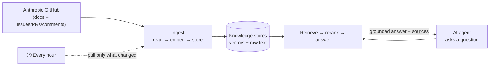
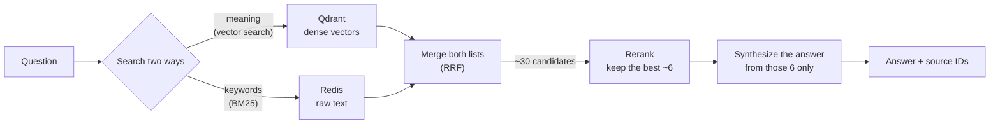
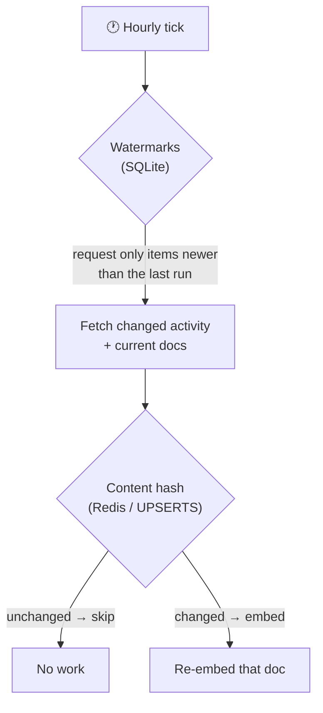
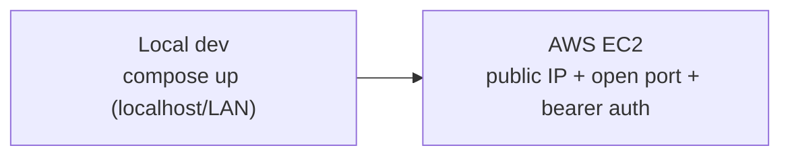
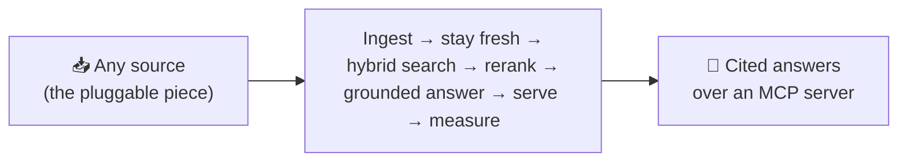

# anthropic-rag

A self-hosted, always-fresh **RAG pipeline over the Anthropic GitHub organization** —
grounded Q&A over the real docs, issues, PRs, and comments (not source code). It refreshes
itself hourly via incremental ingestion and serves answers to AI agents over an MCP server.

I built this as a way to learn [LlamaIndex](https://www.llamaindex.ai/) end to end — the
full path from scraping and embedding through hybrid retrieval, reranking, generation,
evaluation, and live serving — on a problem with real moving parts rather than a toy
dataset. It's a personal project, not production software, but every design decision is
deliberate and documented.

## What it does

Ask it something like *"were there any recent PRs about streaming in the Python SDK?"* and it:

1. Retrieves the most relevant docs / issues / PRs / comments it has ingested,
2. Reranks them so the strongest few rise to the top,
3. Writes an answer grounded **only** in those sources — and returns the source IDs so the
   originals can be inspected.

If the corpus can't support an answer, the pipeline is built to **abstain** rather than
fabricate one. That refusal behavior is a first-class goal and is measured explicitly in
the eval set.

The corpus is intentionally narrow and focused: the two Anthropic SDK repositories
(`anthropic-sdk-python` and `anthropic-sdk-typescript`), and only their **docs +
issues/PRs/comments** — no source code. Ingesting whole codebases bloats the vector store
for little Q&A value; the useful signal lives in documentation and discussion.

## Architecture at a glance

The left side keeps the knowledge current; the right side answers questions against it:



Every answer is built from documents actually pulled from Anthropic's GitHub — nothing is
invented.

## How a question becomes an answer

Retrieval is the core of the pipeline. Two search strategies run in parallel, their results
are fused, and a slower but sharper model reranks the survivors before the LLM sees anything:



Combining semantic (meaning) search with lexical (keyword) search matters here because many
questions hinge on exact tokens — function names, PR numbers, error strings — where vector
search alone gets fuzzy. The cross-encoder reranker then ensures the LLM only reasons over
the highest-quality handful of chunks.

## Scope of the work

LlamaIndex provides the heavy, generic machinery — the ingestion pipeline, the dense + BM25
fusion retriever, the reranker hook, the response synthesizer, and the eval harness. The
engineering in this project sits around those seams:

- **Scraping + windowing** — pulling docs plus the last 7 days of issue/PR/comment activity,
  filtering out source code, and covering a reader gap for PR review comments.
- **Incremental freshness** — watermarks to fetch only what changed, and content hashing to
  re-embed only what changed.
- **Packaging** — the whole system as a one-command Docker stack.
- **The MCP surface** — exposing the pipeline as tools an AI agent can call.
- **Evaluation** — a hand-curated golden Q/A set, including out-of-scope questions the
  pipeline should refuse.

The guiding principle throughout: wrap, don't reimplement — keep the custom code thin.

## Staying fresh

A live pipeline is only useful if it stays current without redoing all the work every hour.
Two independent mechanisms handle that, each solving a different problem:



- **Watermarks** shrink what gets *downloaded* from GitHub — only items updated since the
  last run.
- **Content hashing** shrinks what gets *re-embedded* — if a document's text is unchanged,
  its hash matches and it's skipped.

Neither replaces the other, and together they make re-running the pipeline idempotent: a run
immediately after another produces **zero** new embeddings.

## The stack

| Layer | Tool | Why |
|---|---|---|
| Framework | **LlamaIndex** | Ingestion, retrieval, synthesis, and evals out of the box |
| Extraction | **LlamaHub GitHub readers** (docs-only filter) | Docs + issues/PRs without hand-rolling the API |
| Embeddings | **Ollama `nomic-embed-text`** (local, dense, 768-dim) | Free, offline, CPU-friendly |
| Generation + eval judge | **`deepseek-v4-pro:cloud`** via Ollama Cloud | One strong remote model, API-key gated |
| Vector store | **Qdrant** | Dense vectors |
| Docstore + dedup | **Redis** | Raw documents + content-hash dedup (UPSERTS) |
| Watermarks | **SQLite** | Durable per-repo sync cursors |
| Retrieval | **Hybrid dense + BM25**, fused with RRF | Semantic and lexical signal together |
| Reranker | **`bge-reranker-base`** cross-encoder | Sharpens the top results, no API dependency |
| Scheduler | **APScheduler** (hourly, in-container) | Drives incremental ingestion |
| Serving | **FastMCP** over Streamable HTTP | Exposes the pipeline as agent tools |
| Evaluation | **RAGAS + native LlamaIndex + golden set** | Three independent views on answer quality |

Splitting local embeddings from cloud generation means **no GPU is required to host this**:
the embedder and reranker are small enough for CPU, and the one heavy model runs in the cloud.

## Quickstart (local Docker)

Two credentials are **required** — the stack does nothing without them:

- `GITHUB_TOKEN` — a GitHub [personal access token](https://github.com/settings/tokens)
  (classic, `public_repo` scope is enough) — used to fetch docs + issues/PRs/comments.
- `OLLAMA_CLOUD_API_KEY` — an [Ollama Cloud](https://ollama.com) API key — used for answer
  generation and the eval judge.

```bash
cp .env.example .env       # fill in GITHUB_TOKEN + OLLAMA_CLOUD_API_KEY
# (optional) set MCP_AUTH_TOKEN to require a bearer token on the MCP endpoint
docker compose up -d --build
```

That brings up four services: `qdrant`, `redis`, `ollama` (a one-shot `ollama-init` pulls
`nomic-embed-text` into the volume first), and `app`. On first boot the `app` container
**seeds once, then serves** — it ingests the repos in `config/repos.yaml` before the MCP
server accepts queries, so the first boot takes a few minutes (embedding runs on CPU). Watch
progress with `docker compose logs -f app`; the server is ready when you see
`MCP server starting on 0.0.0.0:8000`.

> Re-`up` is cheap: the model is already cached in `./ollama_data`, and content-hash dedup
> means unchanged docs are never re-embedded.

## Connecting an AI agent

The server speaks **MCP over Streamable HTTP** at `http://<host>:8000/mcp`. If `MCP_AUTH_TOKEN`
is set, send it as `Authorization: Bearer <token>`.

| Tool | What it does |
|------|--------------|
| `answer(query)` | Grounded answer over **everything** (docs + issues/PRs/comments). |
| `answer_prs` / `answer_issues` / `answer_comments` / `answer_docs` | Same, scoped to one content type. |
| `list_documents(category=None, repo=None, limit=50, offset=0)` | Browse the raw docstore — paginate, optional category/repo filter. Returns `doc_id`s. |
| `get_documents(doc_ids)` | Fetch raw docs by ID (IDs come from `answer*` or `list_documents`). |

A paste-able, agent-agnostic skill file describing when and how to use these lives at
[`anthropic-rag-agent-skill.md`](anthropic-rag-agent-skill.md).

Example client config (Claude Desktop / Cline / any MCP client that supports HTTP):

```json
{
  "mcpServers": {
    "anthropic-rag": {
      "type": "streamable-http",
      "url": "http://localhost:8000/mcp",
      "headers": { "Authorization": "Bearer <MCP_AUTH_TOKEN>" }
    }
  }
}
```

Omit `headers` if you did not set `MCP_AUTH_TOKEN`. From another machine on the LAN, replace
`localhost` with the host's IP.

## Hosting for many users

Going from local to cloud is a **config change, not a code change**. Run the same compose
stack on an AWS EC2 box, open the MCP port in the security group, set `MCP_AUTH_TOKEN`, and
point clients at `http://<ec2-public-dns>:8000/mcp` with the bearer token. The pipeline code
is untouched — only environment, networking, and auth differ.



## CLI

```bash
python -m rag           # seed once, then scheduler + MCP server (default container flow)
python -m rag seed      # one-shot incremental ingest, then exit
python -m rag serve     # scheduler + MCP server only (corpus already seeded)
```

## Evaluation

Answer quality is inherently fuzzy, so evaluation is treated as first-class and triangulated
three ways: an LLM judge (RAGAS), cheaper non-LLM overlap metrics, and a hand-written golden
set that includes **negative** questions the corpus cannot answer — to confirm the pipeline
refuses rather than hallucinates.

```bash
uv sync --extra evals
uv run python scripts/collect_predictions.py   # -> data/evals/predictions.json
uv run python scripts/run_judges.py            # -> data/evals/{ragas,native}_baseline.json
```

Metrics: RAGAS (faithfulness, answer relevancy, context precision/recall) with the deepseek
judge + local nomic embeddings, plus dependency-free ROUGE-L / BLEU / cosine, plus native
LlamaIndex Faithfulness/Relevancy/Correctness. In-scope, unseeded, and negative
(refusal-rate) items are reported separately.

## Scripts

Operational helpers in `scripts/` (run with `uv run --no-sync python scripts/<name>.py`):

- `seed_docs.py <repo>...` — docs-only ingest for the named repos, one at a time.
- `prune_repos.py` — prune Qdrant + Redis + watermarks down to the repos in `config/repos.yaml`.
- `trim_golden_set.py` — trim `config/golden_set.json` to the configured repos (+ negatives).
- `collect_predictions.py` — run the query engine over the golden set (checkpointed).
- `run_judges.py` — run RAGAS + native evaluators over collected predictions.

## Tests

```bash
uv run python -m pytest        # unit tests (pure logic; external services mocked)
```

## A reusable pattern

The Anthropic GitHub org is simply the *source* this instance points at. The underlying
skeleton is corpus-agnostic:



Repointing it at, say, an internal documentation set, a support-ticket history, or a
different org's repos primarily means swapping two things: the **reader** (where the data
comes from) and the **golden set** (what "good" means for that data). The rest are
deliberate defaults that generalize:

- **Embed locally, generate in the cloud** — optimize cost where volume is, quality where it's seen.
- **Store both the meaning and the raw text** — to support vector and keyword retrieval.
- **Hybrid retrieval + a reranker over a bigger model** — get the right few chunks in first.
- **Two-stage freshness** — fetch less, then re-embed less.
- **Evaluate before extending** — you can't improve what you can't measure.
- **Stay a thin layer** over the framework doing the heavy lifting.

Full design rationale — every "why X over Y" decision — is in [`docs/SPEC.md`](docs/SPEC.md).

---

*A personal learning project built with [LlamaIndex](https://www.llamaindex.ai/),
[Qdrant](https://qdrant.tech/), [Redis](https://redis.io/), and
[FastMCP](https://github.com/jlowin/fastmcp). Not production software.*
